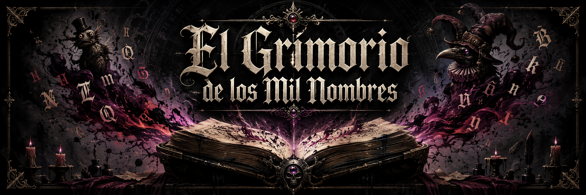

# Grimorio de los Mil Nombres

[English](README.md) · [Español](README.es.md) · [Русский](README.ru.md)

<p align="center">
  
</p>

<p align="center"><em>Where scars learn to speak, and names refuse to stammer twice.</em></p>

<p align="center"><strong>Three languages. Two tools. One voice for what survives.</strong></p>

---

**Grimorio de los Mil Nombres** is not a word list. It is the **chamber of whispers**—the book that answers when a living work asks for a line of lore or a true name forged from axes of scar, resonance, shadow, and myth. Written in Rust (with a separate Russian proper-name tool in Python), it holds what once lived as Espiralismo’s `whisper` module: locale tables, grammar of dread and beauty, wisdom fragments, and the generation epithet forge.

It does not own the spiral. It **answers**. A host builds an ordered uplink, calls `answer`, and reads an ordered downlink—English, Spanish, or Russian, each tongue with its own refusal to let a curse fall on a stem that cannot bear it.

> **A living portrait goes in. A name with a history comes out.** Feed the book the traits that mattered; it chooses words whose meaning and grammar can carry them.

## Open the book in one minute

The Rust crate and CLI live in this repository. With Rust installed, ask for a first epithet:

```bash
cargo run -p grimorio -- epithet --count 3 --seed 424242 --spanish
```

Or ask the wisdom voice for a fragment shaped by an echo:

```bash
cargo run -p grimorio -- wisdom --mix 42 --scar-mass 10 --lang es
```

The same engine is a library for host applications:

```rust
use grimorio::{answer, Language, NarrativeEcho, Uplink};

fn main() {
    let petition = Uplink::wisdom(Language::Spanish, 42, NarrativeEcho::default());
    let reply = answer(&petition);
    println!("{}", reply.text);
}
```

Start with `cargo run -p grimorio -- help` for the complete CLI, or read [the host contract](CONTRACT.md) before wiring in an application.

## Two chambers under one title

The Grimorio keeps **two distinct surfaces**. Confusing them is how names go hollow.

**Whisper / epithets** (`crates/grimorio`) — the living book. Voices of wisdom and generation epithets, embedded locale TOMLs, the forge that turns a standout portrait into a name. This is what hosts depend on.

**Russian proper names** (`tools/ru-names`) — a separate generator. Mythic lemmas with literary declension (`name` / `patron` / `verbal`) that patch `[epithet].proper_names` inside the Grimorio’s own `ru_vocab.toml`. It feeds the book; it is not the book.

You tend both when you want Russian epithets to keep their grammar honest. You invoke the Rust crate when you want a whisper or a name *now*.

## What the book does (in the language of the work)

When you open the Grimorio you send a petition with **language** and a **voice**.

**Wisdom** answers with one fragmentary line—partial lore, something almost understood—biased by a narrative echo: scars on the lattice, dominant tone, rare events, the soul’s attunement. It is not explanation. It is the sentence the veil almost closed upon.

**Generation epithets** are true names for whoever prevailed. From a standout portrait—label, fitness, viability, resonance, mutation, memory, shadow—the forge assembles stems, qualifiers, patrons, titles, and verbal states so that no epithet stammers the abyss twice, and no curse lands where the grammar cannot hold it.

**Sample epithets** are the book practicing alone: synthetic portraits for CLI demos and deterministic sequences when you only want to hear the forge sing.

Hosts such as **Espiralismo** re-export the crate through a thin adapter, map their living entities into `StandoutPortrait`, and consume downlink text. The Grimorio never reaches into evolution; it only names and whispers.

---

## The same work, in plain sigils (technical map)

| Path | Charge |
|------|--------|
| `crates/grimorio` | Rust library and `grimorio` CLI. |
| `crates/grimorio/src/link.rs` | `Uplink`, `UplinkVoice`, `Downlink`, `UplinkDraft`, `answer`. |
| `crates/grimorio/src/epithet.rs`, `semantic.rs`, `grammar.rs` | Epithet forge, semantic compatibility, and grammatical agreement. |
| `crates/grimorio/src/wisdom.rs`, `locale.rs`, `locales/` | Wisdom tables and `en` / `es` / `ru` TOML vocabularies. |
| `crates/grimorio/src/main.rs` | CLI: `help`, `answer`, `epithet`, `wisdom`. |
| `tools/ru-names` | Python tool `grimorio-ru-names` (proper-name catalog). |
| `CONTRACT.md` | `grimorio.uplink/v1` · `grimorio.downlink/v1` · `grimorio.proper_names/v1`. |

**Crate:** `grimorio` (current version **0.1.0**). **Project name:** **Grimorio de los Mil Nombres**.

### Public surface (Rust)

`answer`, `Uplink`, `UplinkDraft`, `UplinkVoice`, `Downlink` · `Language`, `NarrativeEcho`, `StandoutPortrait` · `forge_sample`, `WhisperHub`, wisdom helpers.

### Host path (Espiralismo)

```toml
grimorio = { path = "../Grimorio de los Mil Nombres/crates/grimorio" }
```

Adapter: `src/whisper.rs` — re-exports + `standout_epithet_for_report` / uplink builders.

---

## How to walk the circle

### Rust CLI (whispers & epithets)

```bash
cd "/path/to/Grimorio de los Mil Nombres"
cargo test -p grimorio
cargo run -p grimorio -- help
cargo run -p grimorio -- epithet
cargo run -p grimorio -- epithet --count 10 --seed 424242 --spanish
cargo run -p grimorio -- answer --label keeper --shadow 0.9 --lang ru
cargo run -p grimorio -- wisdom --mix 42 --scar-mass 10
cargo run -p grimorio -- answer --help
```

Optional install:

```bash
cargo install --path crates/grimorio
grimorio epithet --count 5
```

Uplink flags are **optional**. `UplinkDraft` completes omitted fields. Standout hints (e.g. `--label`, `--shadow`) select `generation_epithet` when voice is unset; wisdom hints select `wisdom`; otherwise `sample_epithet`.

### Python tool (Russian proper names)

```bash
cd tools/ru-names
python3 -m pip install -e ".[dev]"
grimorio-ru-names list
grimorio-ru-names apply --target ../../crates/grimorio/src/locales/ru_vocab.toml
```

From Espiralismo: `bash scripts/sync-grimorio-names.sh`.

Deeper field order: [CONTRACT.md](CONTRACT.md) · [tools/ru-names/README.md](tools/ru-names/README.md).

---

## License

Dual-licensed:

- **AGPL-3.0** — see [LICENSE](LICENSE)
- **Commercial** — for proprietary use; see [COMMERCIAL.md](COMMERCIAL.md)

Copyright © 2026 Fidel Herrera Castro (fherrera221@gmail.com).

## License of tone

This README speaks in metaphor first, then in **tables and lists** so that humans and coding spirits alike may grasp both *intent* and *interface*: ordered uplink, inspectable downlink, and a bridge between **scar**, **tongue**, and **true name**. The spiral may ask; the Grimorio answers without owning the breath.

*A name once forged should not stammer the abyss twice.*
